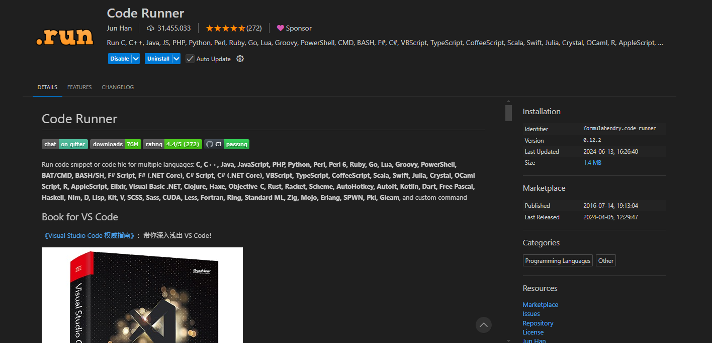
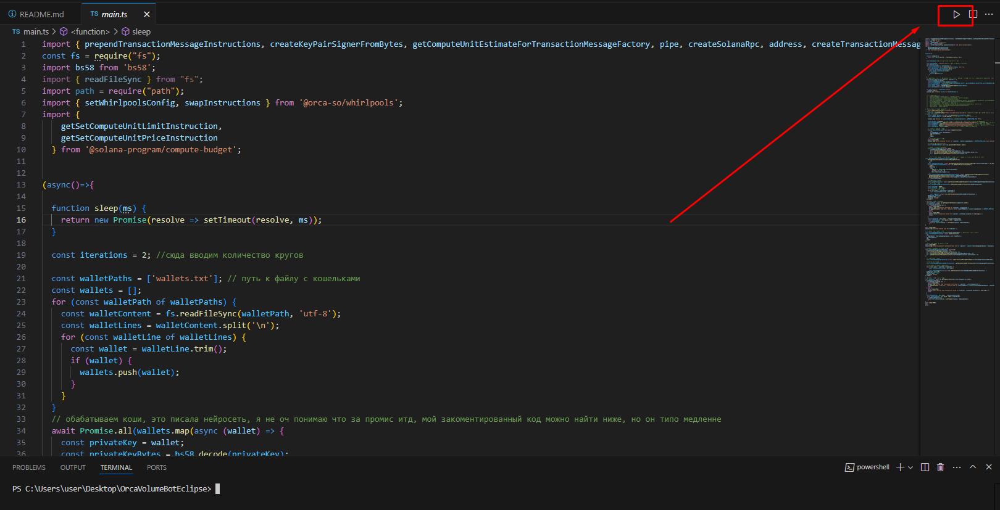
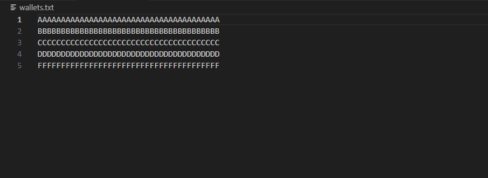
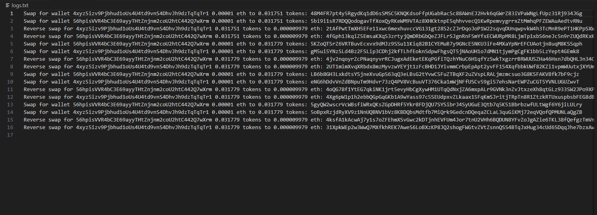

# EclipseOrcaVolumeBot
Софт для объемов на Orca на блокчейне Eclipse.
Софт меняет етх на указанный токен и обратно столько раз, сколько вы укажите и на стольких кошельках, сколько вы введете и на ту сумму, которую вы введете.
# GUIDE RU
### Убедитесь что у вас установлен nodejs и npm https://nodejs.org! Для работы рекомендуется использовать VScode!
Скачайте архив и разархивируйте в любую папку. Откройте командную строку или редактор кода с терминалом и перейдите в папку с ботом(cd C:\ваш путь\), установите зависимости командой ```npm install```, ```npm install -g ts-node```.
Создайте файл wallets.txt, заполните его вашими приватными ключами(каждый с новой строчки). Откройте папку проекта в VScode, установите CodeRunnder(https://marketplace.visualstudio.com/items?itemName=formulahendry.code-runner) и настройте - добавить одну галочку на Code-runner: Run in terminal.
### Настройте софт под себя!
В файле main.ts меняйте следующие строчки:

19 ```const iterations = 2;``` сюда вводим количество кругов, круг это покупка + продажа токена

61 ```const rpc = createSolanaRpc("https://eclipse.helius-rpc.com");``` -  дефолтный эклипс рпц с 25тпс лимитом, если много кошей - желательно заиметь приватный

68 ```const decimals = 1000000;``` - если стейбл - отсавляем так , если токен - меняем на 1000000000

69 ```const whirlpoolAddress = address("44w4HrojzxKwxEb3bmjRNcJ4irFhUGBUjrCYecYhPvqq");``` - ETH/USDC пул, сюда вставляем пул с токеном на который хотите свапать ETH, пулы брать здесь - https://www.orca.so/pools?chainId=eclipse

71 ```const tokenMint = address("AKEWE7Bgh87GPp171b4cJPSSZfmZwQ3KaqYqXoKLNAEE")``` - Адрес токена, менять в зависимости от второго токена в пуле, например для пула ETH/USDC это будет AKEWE7Bgh87GPp171b4cJPSSZfmZwQ3KaqYqXoKLNAEE(адрес USDC), брать прям в пуле

72 ```const inputAmount = BigInt(10000);``` - сколько эфира свапаем, 10000 = 0,00001 eth, если хотим свапать 0.1 ETH - 100000000, и так далее

Запустите код кнопкой плей в правом верхнем углу или ```ts-node main.ts``` и ждите пока он закончит все указанные итерации(можно оставить фоном), если нужно экстренно закрыть программу, жмите ctrl+c в консоли/терминале, по любым вопросам - https://t.me/AXAXAXAXAXAXAXAXAXAXAXXAXAXAA

На консольный вывод можете внимания особо не обращать, он немного кривой и сделан для понимая что все работает. Все нужные логи сохраняются в файл logs.txt! Там можете смотреть какой кошелек сколько чего свапал и увидеть хэш транзакции!

Так будет выглядить расширка


А запускать вот так


Так должен выглядить файл с кошами


А так будут выглядеть логи, все транзы можно проверить самому, свапает на ура


# CEDITS
By t.me/AXAXAXAXAXAXAXAXAXAXAXXAXAXAA

t.me/Logovo_DAO
